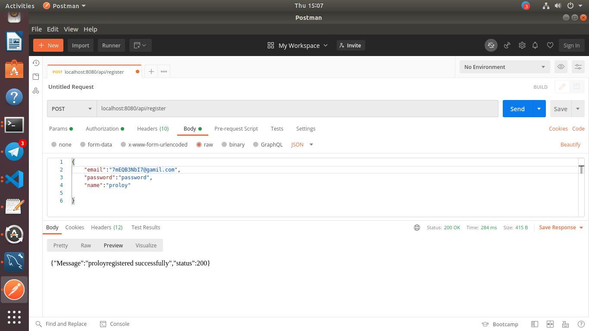
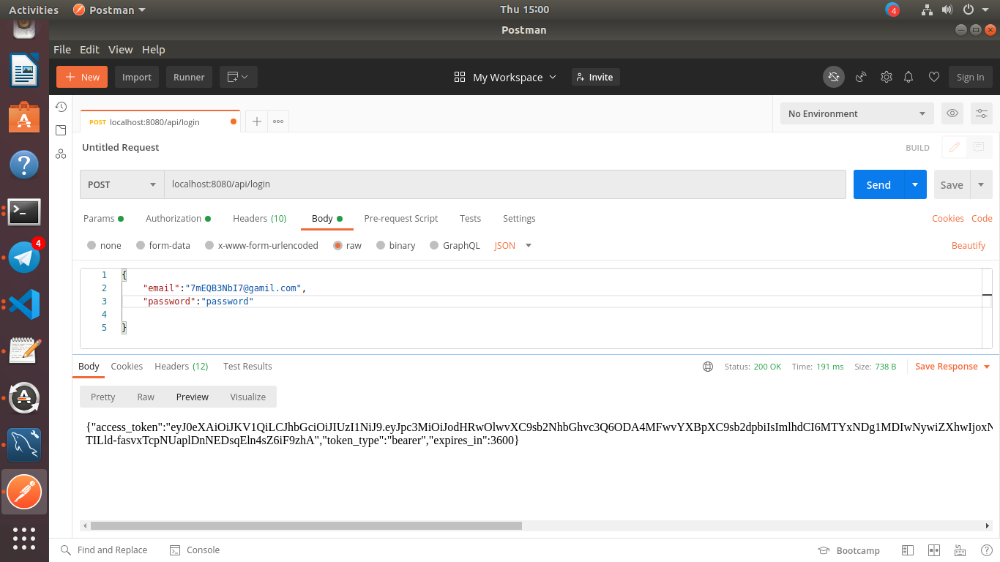
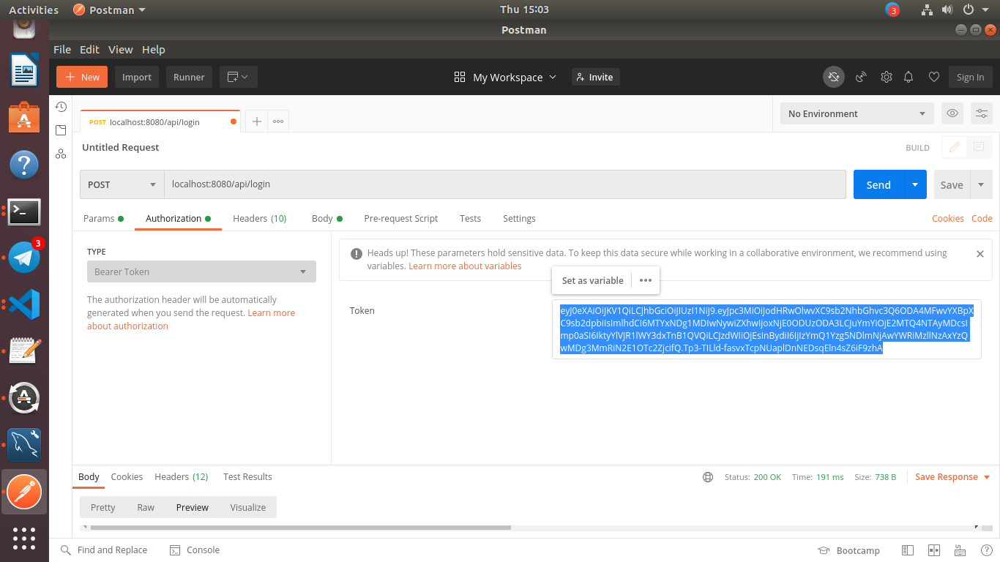
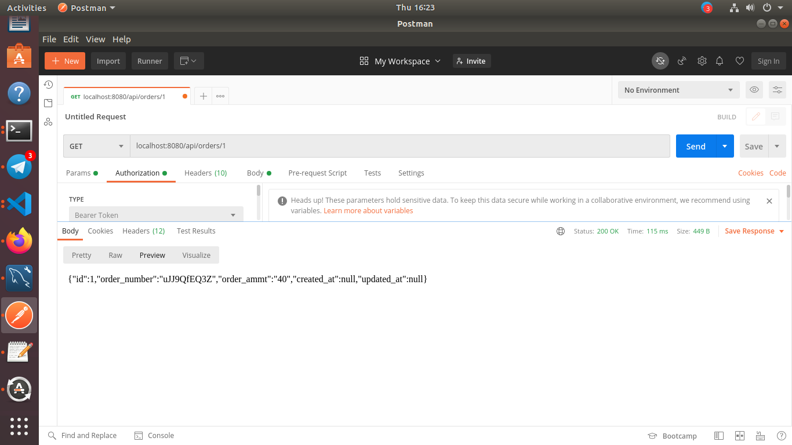

# Rest Laravel jwt 

## What is the use of this project
  This is a rest API service created with laravel 8 and it uses jwt token to authenticate a user.
  One can run this project on docker also. 
  ### Following features available
  1. Receive http requests and send repose back with data or make
     changes of data within database against the http requests.
  2. Recieve POST, GET, DELETE request from an application.
  3. Register and login features with jwt authentication.
  4. Create, edit, delete, search and paginate orders.

## Live Application URL
  Go to this link to visit our live application.
  [Fuzon media react-admin rest api](https://google.com "Live Application Link")

## Prerequisite

### 1. git 
First check if you have git installed in your machine by this command.
`git --version`
If you dont have git in you machine, [install git](https://github.com/git-guides/install-git) for your machine.

### 2. docker
Check this link <https://docs.docker.com/engine/install/>
to install docker on your machine.

### 3. docker-compose
Use this [guidelines](https://docs.docker.com/compose/install/ "install docker-compose") to install docker-compose in your machine.

### 4.react-admin Rest API
[react-admin rest api](https://github.com/fuzonmedia-projects/react-admin-rest-api "react-admin application's github repo") clone this repo and follow [readme](https://github.com/fuzonmedia-projects/react-admin-rest-api/blob/master/README.md) to run this react app in local. You will use this appliaction to make api calls ,fetch and display the data
on web pages. You will able to edit and delete the data also requesting to the api.

You can run this application on any OS (windows, mac, Linux, ubuntu), if you have docker installed on 
your system.

## Run this application

1. Build docker images. 
   #### `docker-compose build`

2. Run the docker containers.
   #### `docker-compose up`

3. create and edit .env file.

check for .env.example and rename it with .env.
   
Set following values in .env file

   * Set DB_PORT 
   * Set DB_DATABASE
   * Set DB_USERNAME 
   * Set DB_PASSWORD

   * Set DB_HOST with the container name of the mysql.
   
   You can found mysql container name in docker-compose.yml file.Do not leave
   password empty or null.
       

3. Run migrations into the docker cotainer.
   #### `docker-compose run php artisan migrate`

4. Laravel application key generate.
   #### `docker-compose run php artisan key:generate`

5. generate jwt secret. 
   #### `docker-compose run php artisan jwt:secret`

6. generate database seed for demo data.
   #### `docker-compose run php artisan db:seed`

## Addtional Command
Some time running this application on
docker you may need run command on the docker container.

set permission for folder run this two command

`sudo docker-compose run tretailapi  chmod -R 755 .`

and

`sudo docker-compose run tretailapi  chmod -R 777 ./storage`

## Start with rest-laravel-jwt

Here you can check the application with postman. we used raw json to send request to the api endpoints.
select raw from body tab. Before sending raw json set Content-Type to application/json from postman header tab. Follow the steps to test the api.

### 1. Register.
  To send request for register a user choose url and write raw json like bellow.
  Then select post request and click on send button. You will get json response like bellow after
  a successfull register to the applicaion.

  

### 2. Login.
   Choose url and write raw json like bellow. Select post request and send.
   If you success fully logged in you will get response like bellow. copy the access_token
   value from json response.

   .

### 3. Set Bearer.
   you need to set bearer like bellow in authorization header to send POST,DELETE,GET
   request to this api/orders/  endpoint. Paste the copied value from previous like the picture.

   

###  4. send get request.
      Send get request with an id of a specific order to
     api/order/{id} endpoint. You will get following response.

     

## Resources
### Laravel 
  Laravel 8 Documentaions page.
  ##### <https://laravel.com/docs/8.x/readme>

### Jwt
   Read this docs to know about how to use jwt in you laravel appliaction.
   ##### <https://jwt-auth.readthedocs.io/en/develop/laravel-installation/>

### Docker
   Visit Docker official website.
   #### <https://docs.docker.com/>

      
    
   
  
